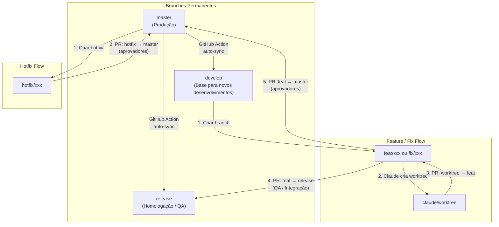

# CLAUDE.md

This file provides guidance to Claude Code (claude.ai/code) when working with code in this repository.

---

## Identidade do projeto

- **Nome:** Personal Finance System
- **Empresa:** MonkeyBomb
- **Autor:** Caique Dias — Desenvolvedor Sênior, autodidata, 10 anos de experiência
- **Stack:** .NET 8 backend + Angular 21 frontend

---

## Comandos

### Backend (.NET)

```bash
# Build
dotnet build PersonalFinance.sln

# Todos os testes
dotnet test PersonalFinance.sln

# Projeto de teste específico
dotnet test tests/PersonalFinance.Api.Tests/PersonalFinance.Api.Tests.csproj

# Teste único pelo nome
dotnet test PersonalFinance.sln --filter "FullyQualifiedName~TestMethodName"

# Rodar a API (Swagger em http://localhost:5000)
dotnet run --project src/PersonalFinance.Api/PersonalFinance.Api.csproj

# Nova migration
dotnet ef migrations add NomeDaMigration --project src/PersonalFinance.Infrastructure --startup-project src/PersonalFinance.Api

# Aplicar migrations manualmente (também roda automático no startup)
dotnet ef database update --project src/PersonalFinance.Infrastructure --startup-project src/PersonalFinance.Api
```

### Frontend (Angular — executar dentro de `personal-finance/`)

```bash
npm start        # ng serve em http://localhost:4200
npm run build    # Build de produção
npm test         # Karma + Jasmine
npm run lint     # TypeScript linting
```

---

## Sprint Planning — Início de Sprint

### Pré-requisito
```bash
gh auth refresh -h github.com -s project
```
Necessário apenas se o token não tiver o escopo `project` (`gh auth status` para verificar).

### Passo a passo

1. **Listar issues abertas no board (coluna Backlog)**
   ```bash
   gh issue list --state open --limit 50 --json number,title,body,labels --repo caiquedias/personal-finance
   ```

2. **Explorar o codebase** — para cada issue, identificar o que já existe e o que falta implementar (controllers, use cases, componentes Angular, padrões reutilizáveis)

3. **Para cada issue, definir:**
   - **Estimativa** em horas (inteiro) — baseada no esforço real de implementação
   - **Prioridade** — ordem de desenvolvimento considerando dependências entre issues e valor de negócio
   - **Size** — `XS` / `S` / `M` / `L` / `XL` conforme criticidade + risco + esforço
   - **Planejamento** — backend e frontend, arquivos afetados, dependências entre issues

4. **Postar comentário de planejamento em cada issue**
   ```bash
   gh issue comment <N> --repo caiquedias/personal-finance --body "..."
   ```
   Formato do comentário:
   ```
   ## 📋 Sprint Planning
   **Estimativa:** Xh | **Prioridade:** N | **Size:** S/M/L/XL | **Risco:** Baixo/Médio/Alto
   ---
   ### Planejamento
   **Backend** — o que criar/alterar
   **Frontend** — o que criar/alterar
   ### Arquivos afetados
   - lista de arquivos
   ```

5. **Obter IDs do projeto e campos**
   ```bash
   gh project list --owner caiquedias --format json
   gh project field-list <PROJECT_NUMBER> --owner caiquedias --format json
   gh project item-list <PROJECT_NUMBER> --owner caiquedias --format json --limit 50
   ```

6. **Atualizar campos no board para cada issue** (Status → Ready, Size, Priority, Estimate)
   ```bash
   gh project item-edit --project-id <PROJECT_ID> --id <ITEM_ID> --field-id <FIELD_ID> --single-select-option-id <OPTION_ID>
   gh project item-edit --project-id <PROJECT_ID> --id <ITEM_ID> --field-id <ESTIMATE_FIELD_ID> --number <HORAS>
   ```

### IDs fixos do projeto Personal Finance (Project #2)

| Campo | Field ID | Opções |
|-------|----------|--------|
| Status | `PVTSSF_lAHOAOhFlc4BUMJ_zhBWAHQ` | Backlog `f75ad846` · Ready `61e4505c` · In progress `47fc9ee4` · In review `df73e18b` · Done `98236657` |
| Priority | `PVTSSF_lAHOAOhFlc4BUMJ_zhBWAPM` | P0 `79628723` · P1 `0a877460` · P2 `da944a9c` |
| Size | `PVTSSF_lAHOAOhFlc4BUMJ_zhBWAPQ` | XS `6c6483d2` · S `f784b110` · M `7515a9f1` · L `817d0097` · XL `db339eb2` |
| Estimate | `PVTF_lAHOAOhFlc4BUMJ_zhBWAPU` | número (horas) |

**Project ID:** `PVT_kwHOAOhFlc4BUMJ_`

### Ciclo de vida da issue durante o desenvolvimento

| Evento | Ação no board |
|--------|--------------|
| Análise concluída (Sprint Planning) | Mover para **Ready** |
| Início da implementação | Mover para **In Progress** |
| PR worktree → feat criado | Mover para **In Review** |
| PR feat aprovado | Vincular branch `feat/` à issue |

### Regras obrigatórias de rastreabilidade

- **Toda PR criada no contexto de uma issue deve ser vinculada à própria issue** — garante rastreabilidade completa de todas as implementações
- **Quando a primeira PR for aprovada (worktree → feat)**, vincular a branch `feat/` à issue no GitHub

---

## Versionamento

### Branches permanentes

| Branch | Propósito |
|--------|-----------|
| `master` | Produção — código aprovado e publicado |
| `release` | Homologação — QA, testes de integração |
| `develop` | Base para novos desenvolvimentos — espelho de `master` |

### Regras

- Nenhum push direto para `master`, `release` ou `develop` — apenas via Pull Request
- `develop` nunca recebe commits diretos — serve exclusivamente como base para criar branches
- Prefixos obrigatórios: `feat/` para novas features, `fix/` para correções planejadas, `hotfix/` para correções urgentes em produção
- Branches de worktree Claude usam prefixo `claude/` (gerenciado automaticamente)

### Fluxo Feature / Fix

1. Criar `feat/xxx` ou `fix/xxx` a partir de `develop`
2. Claude trabalha em worktree (`claude/worktree-branch`) criado a partir da branch de feature/fix
3. PR: `claude/worktree` → `feat/xxx` (sem aprovadores)
4. PR: `feat/xxx` → `release` (QA + testes de integração)
   - Bug encontrado em QA: fix aplicado na `feat/xxx`, novo PR para `release`
5. PR: `feat/xxx` → `master` (requer aprovação do grupo)
6. Merge em `master` dispara GitHub Action → sync automático: `develop` ← `master` e `release` ← `master`

### Regra obrigatória de push no worktree

O worktree Claude tem upstream configurado para a `feat/` — **nunca fazer push direto para ela**.

Sequência correta:
```bash
# 1. Publicar SOMENTE na branch claude/
git push origin HEAD:claude/<nome-worktree>

# 2. Criar PR: claude/ → feat/ (com delta, revisável)
gh pr create --head claude/<nome-worktree> --base feat/xxx ...
```

Se o push acidental for para a `feat/`, corrigir com:
```bash
# Reverter feat/ ao commit anterior (antes da implementação)
git push origin <commit-anterior>:refs/heads/feat/xxx --force
# Agora claude/ tem delta → criar PR normalmente
```

### Fluxo Hotfix

1. Criar `hotfix/xxx` a **partir de `master`** (não de `develop`) — garante estado exato de produção
2. PR: `hotfix/xxx` → `master` (requer aprovação do grupo)
3. Merge em `master` dispara GitHub Action → sync automático: `develop` ← `master` e `release` ← `master`

> A branch `feat/fix/hotfix` permanece viva durante todo o ciclo até a publicação em `master`.

### Fluxograma



### Setup dos git hooks

Após clonar o repositório, configurar o caminho dos hooks:

```bash
git config core.hooksPath .githooks
```

---

## Arquitetura

### Backend — Clean Architecture

Regra de dependência: `Api → Infrastructure → Application → Domain`

- **Domain** (`src/PersonalFinance.Domain/`) — Entidades (User, Category, Period, Expense, Income), value objects, enums, interfaces de repositório, exceções de domínio. Sem dependências externas. Entidades usam factory `static Create()`.
- **Application** (`src/PersonalFinance.Application/`) — Use cases (uma classe por use case), DTOs, validadores FluentValidation. `IReportRepository` fica aqui — evita dependência circular com Domain.
- **Infrastructure** (`src/PersonalFinance.Infrastructure/`) — `AppDbContext` EF Core, repositórios (Unit of Work), `Argon2PasswordHasher`, `JwtTokenService`, `ExcelParserService`, `DatabaseInitializer` (hosted service que aplica migrations e cria `vw_PeriodSummary` no startup).
- **Api** (`src/PersonalFinance.Api/`) — Controllers em `/api/v1/`, `ExceptionMiddleware` global, DI em `InfrastructureExtensions` e `ApplicationExtensions`.

### Modelo de dados

| Entidade | Propósito |
|----------|-----------|
| User | Autenticação (hash Argon2id) |
| Category | Classificação de despesas, por usuário |
| Period | Container mensal (Year + Month, um ativo por usuário) |
| Expense | Transação com DueDate, PaymentDate, Status, Fortnight |
| Income | Receita com SourceType |

Lookup tables (seeded): `Role`, `PaymentStatus`, `SourceType`, `FortnightType`.

Todas as entidades têm soft-delete (`DeletedAt`) com `HasQueryFilter` global no `AppDbContext`.

### vw_PeriodSummary

View SQL criada pelo `DatabaseInitializer`. Agrega totais de receita/despesa por período (saldo, pago/a pagar, primeira/segunda quinzena). Usada em `GetPeriodSummaryUseCase`. Recriada de forma idempotente no startup. Usa subconsultas separadas para Income e Expense — evita produto cartesiano.

### Autenticação

JWT Bearer com claims de role. `AuthController` é `[AllowAnonymous]`; demais requerem `[Authorize]`. Endpoints admin requerem `[Authorize(Roles="Admin")]`. O `authInterceptor` Angular injeta o token automaticamente.

### Frontend — Angular 21

Standalone components (sem NgModules). Rotas lazy-loaded em `app.routes.ts`:

- `auth/` — Login
- `dashboard/`, `periods/`, `expenses/`, `incomes/` — Features principais
- `config/` — Categorias e configurações; `config/admin/users` protegida por `adminGuard`
- `import/` — Importação de dados legados via Excel

`ApiService` em `core/` é o wrapper HTTP. `ThemeService` controla dark/light mode. Signals para estado local, RxJS para HTTP.

### Database

SQL Server LocalDB para dev: `(localdb)\MSSQLLocalDB;Database=PersonalFinanceDb`. Connection string e JWT settings em `appsettings.json`.

### Testes

- Integration tests em `PersonalFinance.Api.Tests/Integration/` usam `WebApplicationFactory<Program>` com banco InMemory.
- Domain e Application tests usam Moq + FluentAssertions.
- Infrastructure tests cobrem `ExcelParserService`.

---

## Regras absolutas de execução

- **Nunca alterar fora do escopo** — qualquer alteração não prevista no plano de execução deve ser apresentada como novo plano antes de ser implementada; Caique avalia e aprova caso a caso
- **Verificar PR antes de push** — antes de subir qualquer ajuste, verificar se o PR destino ainda está aberto; se estiver, apenas commitar e fazer push; se estiver fechado/mergeado, abrir novo PR para os ajustes

---

## Regras absolutas de código

### Geral
- **Um arquivo por classe** — sem exceção
- Idioma: inglês no código, comentários em PT-BR
- **Interfaces: nunca reescrever** — sempre `str_replace` cirúrgico para adicionar métodos
- **Correções pontuais**: sempre via `str_replace` — nunca reescrever arquivo inteiro por 1 linha

### Backend (.NET 8)
- PKs: `Guid.NewGuid()` no Domain, `ValueGeneratedNever()` no EF Core
- Soft delete: `DeletedAt IS NOT NULL` — `HasQueryFilter` global no `AppDbContext`
- `async` nunca usa `ref`/`out` — usar tuple de retorno `(T value, bool flag)`
- Enums mapeados como `int` com `.HasConversion<int>()`
- `OnDelete(Restrict)` em todas as FKs

### Frontend (Angular 21)
- Standalone Components — sem NgModule
- Animações de modal: usar `@if` no template com triggers Angular Animations
- **Não usar CDK Portal/OverlayRef** para animações — `:enter`/`:leave` não disparam via portal
- `DecimalPipe` deve ser importado explicitamente em cada componente standalone

---

## Regras de testes

- Não gerar testes para use cases que são cópias de padrões já cobertos
- Gerar testes apenas onde há **lógica de negócio nova**
- Testes unitários: xUnit + Moq + FluentAssertions — um arquivo por classe de teste
- `MarkAsPaid` rejeita data futura — usar `DateOnly.FromDateTime(DateTime.UtcNow.AddDays(-1))` nos testes
- `HasData` não popula InMemory — semear manualmente via `SeedLookupData()` na factory

---

## TestWebApplicationFactory — 3 substituições obrigatórias

```csharp
// 1. Remove TODOS os descritores do AppDbContext
var dbDescriptors = services.Where(d =>
    d.ServiceType == typeof(DbContextOptions<AppDbContext>) ||
    d.ServiceType == typeof(AppDbContext) ||
    (d.ServiceType.IsGenericType &&
     d.ServiceType.GenericTypeArguments.Contains(typeof(AppDbContext))))
    .ToList();
foreach (var d in dbDescriptors) services.Remove(d);
services.AddDbContext<AppDbContext>(o => o.UseInMemoryDatabase(_dbName));
// _dbName gerado como campo da factory — NUNCA dentro do lambda

// 2. IReportRepository → FakeReportRepository (SqlQueryRaw é relacional)
// 3. DatabaseInitializer → remover por ImplementationType?.Name == "DatabaseInitializer"
```

---

## Padrão de modal Angular (validado)

```typescript
// Template
@if (modalOpen()) {
  <div class="modal-overlay" @backdropAnim (click)="closeModal()"></div>
  <div class="modal-center" @modalAnim>
    <app-sonic-modal [title]="..." (closed)="closeModal()">
      <!-- conteúdo -->
    </app-sonic-modal>
  </div>
}

// Animations no componente
animations: [
  trigger('backdropAnim', [
    transition(':enter', [style({opacity:0}), animate('200ms ease', style({opacity:1}))]),
    transition(':leave', [animate('180ms ease', style({opacity:0}))])
  ]),
  trigger('modalAnim', [
    transition(':enter', [
      style({opacity:0, transform:'scale(0.88) translateY(-16px)'}),
      animate('260ms cubic-bezier(0.34,1.56,0.64,1)',
        style({opacity:1, transform:'scale(1) translateY(0)'}))
    ]),
    transition(':leave', [
      animate('180ms ease-in',
        style({opacity:0, transform:'scale(0.93) translateY(10px)'}))
    ])
  ])
]
```

---

## Armadilhas conhecidas — nunca repetir

| Erro | Causa | Fix |
|------|-------|-----|
| Dois providers EF Core no teste | `IDbContextOptionsConfiguration<T>` persiste | Remover por `GenericTypeArguments.Contains(typeof(AppDbContext))` |
| `async` com `ref int` | C# não permite ref em async | Retornar tuple `(Guid id, bool wasCreated)` |
| `InvalidCastException Int16→Int32` | `PeriodSummaryRaw.Year` como `int` | Usar `short` (smallint) e `byte` (tinyint) |
| `NG8004 No pipe 'number'` | `DecimalPipe` não importado | Adicionar ao `imports[]` do componente |
| Namespace duplicado controller | Dois arquivos com mesma classe | Substituir, nunca adicionar segundo |
| Builder Angular errado | `@angular-devkit/build-angular:application` | Usar `@angular/build:application` |
| TypeScript incompatível com Angular 21 | `~5.6.0` | Usar `~5.9.0` |
| Node.js antigo com Vite | `require()` de ES Module | Node.js ≥ 20 obrigatório |
| `TemplatePortalDirective` não exportado | Removido do CDK | Remover o import |
| Animação não dispara via CDK Portal | `:enter`/`:leave` exigem `@if` | Usar modal inline com `@if` + Angular Animations |
| Interface reescrita perde métodos | ZIP sobrescreve sem consultar código atual | Nunca reescrever interfaces — sempre `str_replace` |
| `MarkAsPaid` rejeita data futura | Validação na entidade | Usar `UtcNow.AddDays(-1)` nos testes |
| `HasData` não popula InMemory | EF Core HasData é SQL only | `SeedLookupData()` manual na factory |
| Produto cartesiano na `vw_PeriodSummary` | JOIN duplo Income + Expense | Subconsultas separadas por entidade |
| B4/C4 sem fórmula no parser Excel | Planilha salva sem fórmulas | Fallback via `TryGetValue()` na célula |

---

## Estilo de comunicação

- Respostas diretas e técnicas — sem rodeios
- Diagnóstico de erro: **causa + fix cirúrgico** — sem texto introdutório desnecessário
- **Nunca fazer suposições silenciosas** sobre ambiguidades — alinhar antes de implementar
- Não usar validação ou elogios no meio das respostas
- Explicações didáticas apenas quando solicitado
- **Caique decide** a arquitetura — Claude propõe opções, Caique confirma
- Quando houver tradeoff, apresentar antes de recomendar

---

## Otimização de tokens — regras obrigatórias

### Respostas
- Curtas e diretas — sem introduções, conclusões ou explicações não solicitadas
- Nunca repetir código ou texto já fornecido anteriormente
- Formato padrão: código direto ou trecho pontual de alteração

### Geração de código
- Gerar apenas o estritamente necessário para a tarefa
- **Nunca reescrever arquivos completos** se apenas partes precisam mudar — usar `str_replace` cirúrgico
- Ao continuar tarefas, gerar apenas o delta incremental

### Planning Mode
- Usar apenas para tarefas complexas
- Máximo 5 passos, 1 linha por passo, sem explicações detalhadas

### Escopo
- Responder exatamente o que foi pedido — nada além
- Não antecipar próximas etapas nem expandir escopo por conta própria
- Debug: focar só no erro informado, retornar só a correção, priorizar a solução mais provável

### Contexto
- Considerar contexto anterior como conhecido — não repetir
- Inputs grandes: usar apenas as partes relevantes para a tarefa atual

### Regras críticas
- NUNCA gerar código além do solicitado
- NUNCA incluir explicações não solicitadas
- SEMPRE priorizar menor quantidade de tokens possível

---

*CLAUDE.md — Personal Finance System — MonkeyBomb — Abril 2026*
